# Введение в разработку Android приложений с Jetpack Compose и Material Design 3

## Введение 

- **Цели занятия**: Изучение основ создания интерфейсов для Android приложений с использованием Jetpack Compose и Material Design 3.
  
- **Обзор Android Studio**:
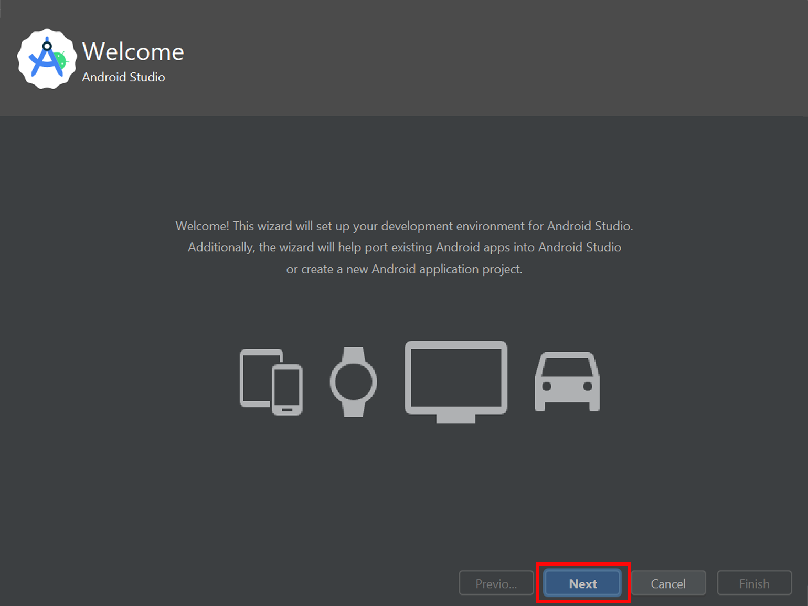
 

- **Аналогия**: Android Studio как кухня для разработчика, где каждый инструмент на своем месте.

## Установка и настройка Android Studio

- **Установка Android Studio**:

  Чтобы установить Android Studio в Windows, выполните следующие действия:

**Если вы загрузили файл .exe (рекомендуется), дважды щелкните его, чтобы запустить. В видео подробная инструкция установки Android Studio для Windows**

 [](https://developer.android.com/static/studio/videos/studio-install-windows.mp4?hl=ru)

Если вы загрузили .zip файл:

1. Распакуйте .zip .
2. Скопируйте папку android-studio в папку Program Files .
3. Откройте папку android-studio > bin .
4. Запустите studio64.exe (для 64-битных машин) или studio.exe (для 32-битных машин).
5. Следуйте указаниям мастера установки в Android Studio и установите все рекомендуемые пакеты SDK.

  - **Создание нового проекта**:
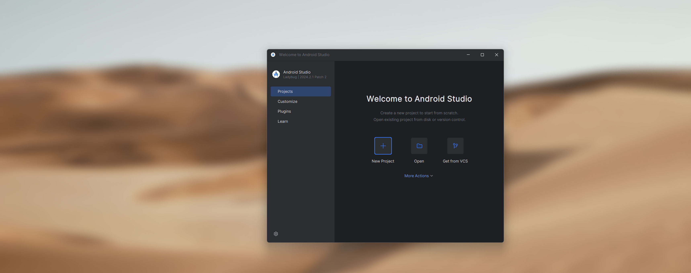
1. Откройте Android Studio.
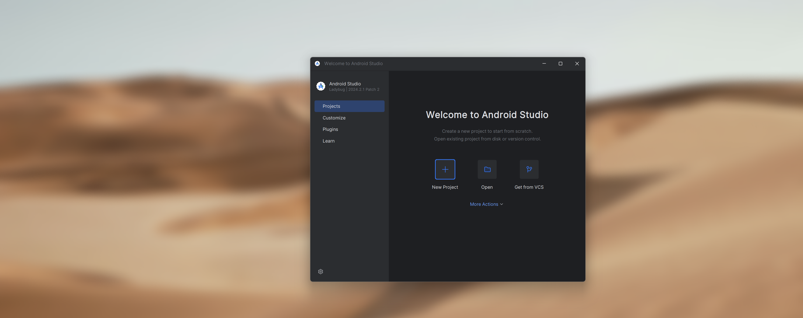
2. Выберите "New Project".
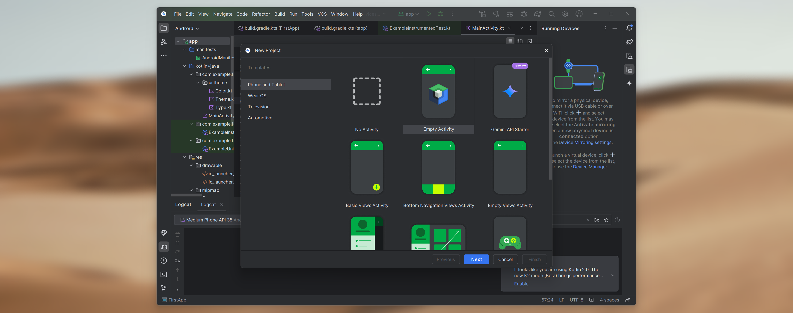
3. Выберите шаблон "Empty Activity".
4. Настройка проекта (имя, пакет, минимальная версия SDK).
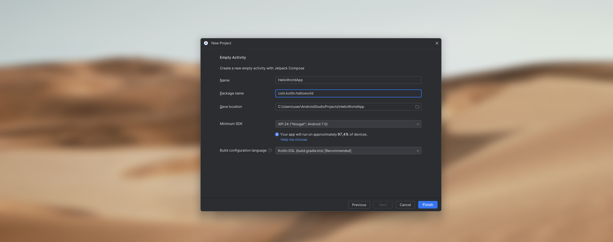
* Первая строчка название проекта
* Package name  имя пакета приложения. Должно быть уникальным для размещения в GooglePlay
* Расположение выбираем сами, желательно использовать по умолчанию или единую папку для всех проектов
* Минимальный SDK отвечает за поддержку новых фич и степень поддержки версий android для запуска приложения. Рекомендую выбирать SDK близкий для вашего телефона. Сниежние версии для поддержки широкой массы смартфонов будет актуально только на этапе размешения в Play Store.
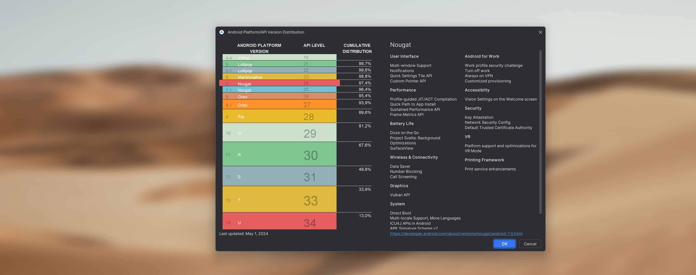
По клику на ссылку Help me choose, android sdk показывает таблицу соотносящую SDK и версию android с внедренными фичами.

* Последняя строчка оставляем kotlin, как приоритетное решение для сборки при обновленном подходе.

## Структура проекта
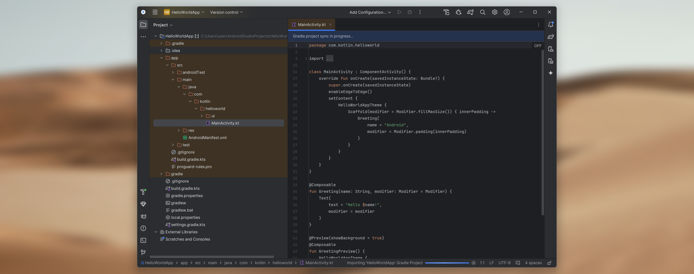
# 📂 Структура Android проекта

Android проект имеет определенную структуру файлов и папок, которые организуют исходный код, ресурсы и конфигурационные файлы. Вот основные компоненты стандартного проекта:

```kotlin

MyApplication/
├── .idea/
├── app/
│   ├── build/
│   ├── libs/
│   ├── build.gradle.kts
│   ├── proguard-rules.pro
│   └── src/
│       ├── androidTest/
│       │   └── kotlin/
│       ├── main/
│       │   ├── AndroidManifest.xml
│       │   ├── kotlin/
│       │   ├── res/
│       │   └── assets/
│       └── test/
│           └── kotlin/
├── build/
├── gradle/
├── gradle.properties
├── gradlew
├── gradlew.bat
├── settings.gradle.kts
└── README.md


```

Разберем каждый из этих элементов подробно.

## Основные директории и файлы

## **Корневой каталог проекта `MyApplication/`**

Это основная папка вашего проекта, содержащая ключевые файлы и каталоги:

- **`.idea/`**:  
  Конфигурационные файлы Android Studio/IntelliJ IDEA. Содержит настройки проекта, схемы сборки и другие данные, специфичные для среды разработки.

- **`app/`**:  
  Главный модуль приложения. Здесь находятся исходный код, ресурсы и конфигурационные файлы приложения.

- **`build/`**:  
  Автоматически генерируемая папка, содержащая результаты сборки проекта, скомпилированные файлы и артефакты.

- **`gradle/`**:  
  Содержит файлы Gradle Wrapper для обеспечения использования одной и той же версии Gradle всеми разработчиками.

- **`gradlew`, `gradlew.bat`**:  
  Скрипты для запуска Gradle Wrapper на UNIX и Windows системах соответственно.

- **`settings.gradle.kts`**:  
  Файл настроек Gradle, написанный с использованием Kotlin DSL. Определяет модули, включенные в проект.

- **`gradle.properties`**:  
  Файл свойств Gradle. Используется для установки глобальных настроек сборки.

- **`README.md`**:  
  Документация проекта, содержащая описание, инструкции по сборке и другую полезную информацию.

---

## **Папка `app/`**

Основной модуль приложения, содержащий исходный код, ресурсы и конфигурационные файлы.

### **`app/build/`**

  Содержит сгенерированные файлы сборки, такие как скомпилированные классы, объединенные ресурсы и т.д.

### **`app/libs/`**

  Папка для хранения локальных зависимостей в виде `.jar` или `.aar` файлов.

### **`app/build.gradle.kts`** (Module-level build file)

  Файл конфигурации Gradle для модуля приложения, использующий Kotlin DSL.

- **Основные секции**:
  
  - **`plugins`**:  
    Определяет плагины Gradle, необходимые для проекта.
  
``` kotlin    
    plugins {
    alias(libs.plugins.android.application)
    alias(libs.plugins.kotlin.android)
    alias(libs.plugins.kotlin.compose)
}
```    

  - **`android { ... }`**:  
    Настройки Android, включая версии SDK, параметры сборки, сборки и т.д.

``` kotlin   
    android {
    namespace = "com.kotlin.helloworld"
    compileSdk = 34

    defaultConfig {
        applicationId = "com.kotlin.helloworld"
        minSdk = 34
        targetSdk = 34
        versionCode = 1
        versionName = "1.0"

        testInstrumentationRunner = "androidx.test.runner.AndroidJUnitRunner"
    }

    buildTypes {
        release {
            isMinifyEnabled = false
            proguardFiles(
                getDefaultProguardFile("proguard-android-optimize.txt"),
                "proguard-rules.pro"
            )
        }
    }
    compileOptions {
        sourceCompatibility = JavaVersion.VERSION_11
        targetCompatibility = JavaVersion.VERSION_11
    }
    kotlinOptions {
        jvmTarget = "11"
    }
    buildFeatures {
        compose = true
    }
}
```    

  - **`dependencies { ... }`**:  
    Определяет зависимости проекта.

``` kotlin    
     implementation(libs.androidx.core.ktx)
    implementation(libs.androidx.lifecycle.runtime.ktx)
    implementation(libs.androidx.activity.compose)
    implementation(platform(libs.androidx.compose.bom))
    implementation(libs.androidx.ui)
    implementation(libs.androidx.ui.graphics)
    implementation(libs.androidx.ui.tooling.preview)
    implementation(libs.androidx.material3)
    testImplementation(libs.junit)
    androidTestImplementation(libs.androidx.junit)
    androidTestImplementation(libs.androidx.espresso.core)
    androidTestImplementation(platform(libs.androidx.compose.bom))
    androidTestImplementation(libs.androidx.ui.test.junit4)
    debugImplementation(libs.androidx.ui.tooling)
    debugImplementation(libs.androidx.ui.test.manifest)
```   

### **`app/proguard-rules.pro`**

  Правила для ProGuard/R8 - инструментов минификации и обфускации кода.

### **`app/src/`**

Содержит исходный код и ресурсы приложения, организованные по сборкам и конфигурациям.

#### **`app/src/main/`**

  Основной исходный код и ресурсы приложения.


  - **`AndroidManifest.xml`**:  
    Манифест приложения, описывающий его компоненты, разрешения и другие метаданные.

 ``` xml    
   <?xml version="1.0" encoding="utf-8"?>
<manifest xmlns:android="http://schemas.android.com/apk/res/android"
    xmlns:tools="http://schemas.android.com/tools">

    <application
        android:allowBackup="true"
        android:dataExtractionRules="@xml/data_extraction_rules"
        android:fullBackupContent="@xml/backup_rules"
        android:icon="@mipmap/ic_launcher"
        android:label="@string/app_name"
        android:roundIcon="@mipmap/ic_launcher_round"
        android:supportsRtl="true"
        android:theme="@style/Theme.HelloWorldApp"
        tools:targetApi="31">
        <activity
            android:name=".MainActivity"
            android:exported="true"
            android:label="@string/app_name"
            android:theme="@style/Theme.HelloWorldApp">
            <intent-filter>
                <action android:name="android.intent.action.MAIN" />

                <category android:name="android.intent.category.LAUNCHER" />
            </intent-filter>
        </activity>
    </application>

</manifest>
```    

- **`kotlin/`**:  
    Исходный код на языке Kotlin.

    **Пример структуры пакетов:**

```
    app/src/main/kotlin/com/example/myapplication/
    ├── MainActivity.kt
    └── ui/
        ├── theme/
        │   ├── Color.kt
        │   ├── Theme.kt
        │   └── Type.kt
        └── components/
            └── Greeting.kt
```

- **`MainActivity.kt`**:  
      Главная активити приложения, наследующая `ComponentActivity` и задающая контент с помощью `setContent`.

 ``` kotlin      
      package com.kotlin.helloworld

import android.os.Bundle
import androidx.activity.ComponentActivity
import androidx.activity.compose.setContent
import androidx.activity.enableEdgeToEdge
import androidx.compose.foundation.layout.fillMaxSize
import androidx.compose.foundation.layout.padding
import androidx.compose.material3.Scaffold
import androidx.compose.material3.Text
import androidx.compose.runtime.Composable
import androidx.compose.ui.Modifier
import androidx.compose.ui.tooling.preview.Preview
import com.kotlin.helloworld.ui.theme.HelloWorldAppTheme

class MainActivity : ComponentActivity() {
    override fun onCreate(savedInstanceState: Bundle?) {
        super.onCreate(savedInstanceState)
        enableEdgeToEdge()
        setContent {
            HelloWorldAppTheme {
                Scaffold(modifier = Modifier.fillMaxSize()) { innerPadding ->
                    Greeting(
                        name = "Android",
                        modifier = Modifier.padding(innerPadding)
                    )
                }
            }
        }
    }
}

@Composable
fun Greeting(name: String, modifier: Modifier = Modifier) {
    Text(
        text = "Hello $name!",
        modifier = modifier
    )
}

@Preview(showBackground = true)
@Composable
fun GreetingPreview() {
    HelloWorldAppTheme {
        Greeting("Android")
    }
}
```      

- **`ui/theme/`**:  
      Папка с файлами темы приложения.

    - **`Color.kt`**: Определение цветовой схемы.
    - **`Type.kt`**: Настройка шрифтов.
    - **`Theme.kt`**: Функция темы, объеденить цвета и шрифты.

- **`res/`**:  
    Ресурсы приложения (изображения, строки, цвета и т.д.).


#### **`app/src/androidTest/`**

  Код для инструментальных тестов, выполняемых на реальном устройстве или эмуляторе.

#### **`app/src/test/`**
  
  Код для локальных юнит-тестов, выполняемых на JVM.

---

## **Корневой `build.gradle.kts`**

  Файл настроек Gradle на уровне проекта, использующий Kotlin .

 ``` kotlin
  pluginManagement {
      repositories {
          gradlePluginPortal()
          google()
          mavenCentral()
      }
  }

  dependencyResolutionManagement {
      repositoriesMode.set(RepositoriesMode.FAIL_ON_PROJECT_REPOS)
      repositories {
          google()
          mavenCentral()
      }
  }

  rootProject.name = "MyApplication"
  include(":app")
  
```
---

## **`settings.gradle.kts`**

  Файл настроек проекта Gradle, определяющий имя проекта и модули.

- **Пример**:

  rootProject.name = "MyApplication"
  include(":app")
  

---

## **`gradle.properties`**

  Файл свойств Gradle для глобальных настроек сборки.

 ```properties 
  org.gradle.jvmargs=-Xmx2048m -Dfile.encoding=UTF-8
  android.useAndroidX=true
  kotlin.code.style=official
 ``` 

---

## **Установка эмулятора и запуск приложения**
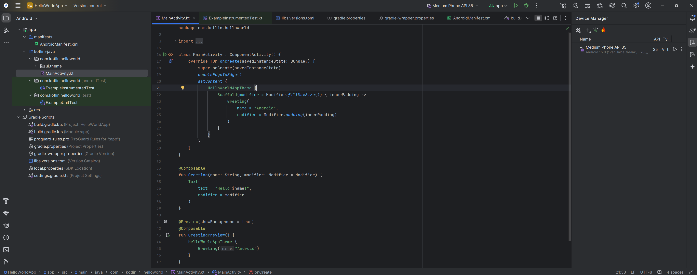
### **Установка эмулятора**
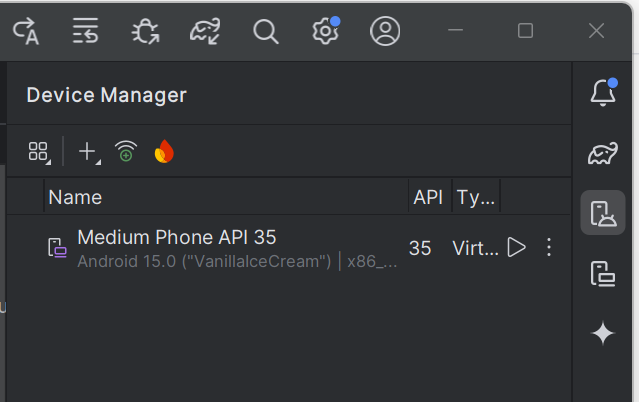
1. **Открыть Device Manager:**

   - В Android Studio выбираем **"View"** ➔ **"Tool Windows"** ➔ **"Device Manager"**.
   - Либо выбрать и нажать на иконку справа сверху **Device Manager** 
    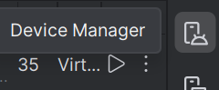 
.

2. **Создание виртуального устройства:**

   - Нажмите кнопку + **"Add new device"**.
   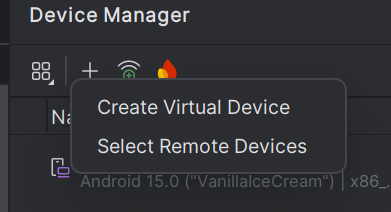
   - Create Virtual Device
   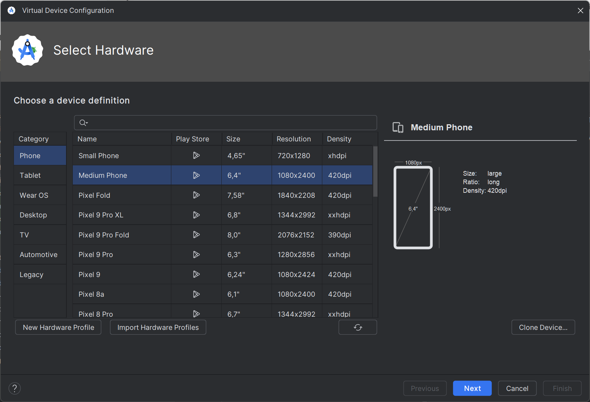
   - Выберите необходимое устройство из списка, желательно со схожими параметрами с вашим физически устройством (например, **Pixel 9**) далее **"Next"**.

3. **Выбор системы (System Image):**

   - Выберите версию Android. Рекомендуется использовать последнюю стабильную версию.
   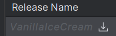
   - Если система не скачана, нажмите **"Download"** и дождитесь завершения загрузки.
   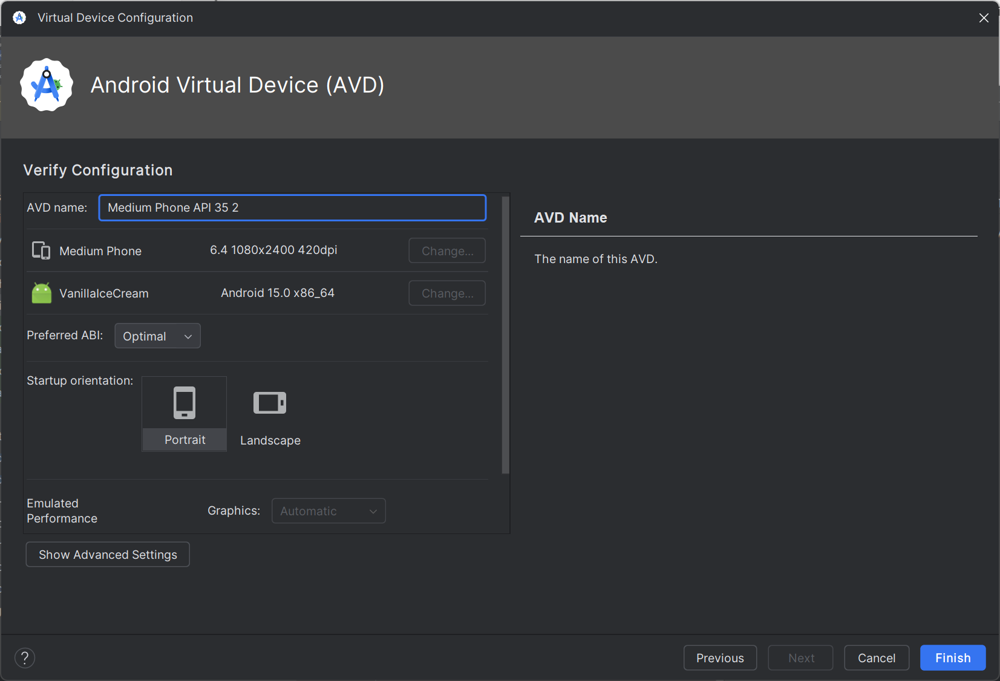
   - Далее нажмите **"Next"**.

4. **Настройка конфигурации AVD:**
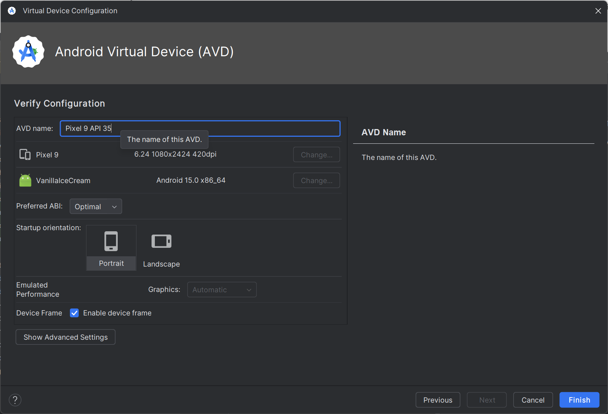
   - Можно задать необходимые параметры (имя, ориентация, размер виртуальной памяти и т.д.).
   Например выбрать устройства с разным размером, разрешением и ориентацией и назвать вместо Pixel 9 pro, например телефон в горизонтальном положение.
   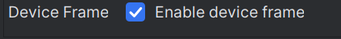
   - Последний пунки **"Enable Device Frame"** используется для отображения визуального представления рамки устройства. Более декоративный элемент для понимания пропрций и внешнего вида, если устройство используемой для разработки с маленьким экраном, рекомендую отключить рамки.

5. **Завершение создания AVD:**

   - Нажмите **"Finish"**.

6. **Запуск эмулятора:**
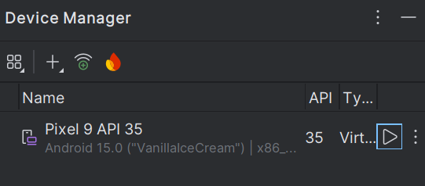
   - В списке устройств в **Device Manager** найдите созданный эмулятор и нажмите кнопку **"Launch this AVD in the emulator"** (значок **▶**).
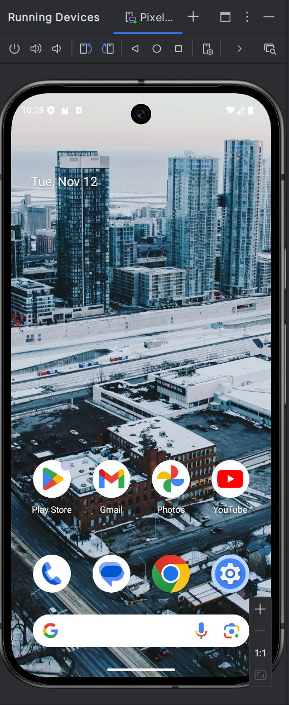
### **Запуск приложения на эмуляторе**

1. **Выбор эмулятора в Android Studio:**
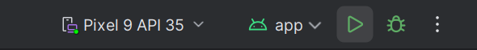
   - В панели инструментов рядом с кнопкой **"Run"** убедитесь, что выбран ваш эмулятор.

2. **Запуск приложения:**
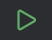
   - Нажмите кнопку **"Run App"** (зелёный треугольник) или используйте сочетание клавиш **Shift + F10**.
   - Android Studio соберёт приложение и установит его на эмулятор.

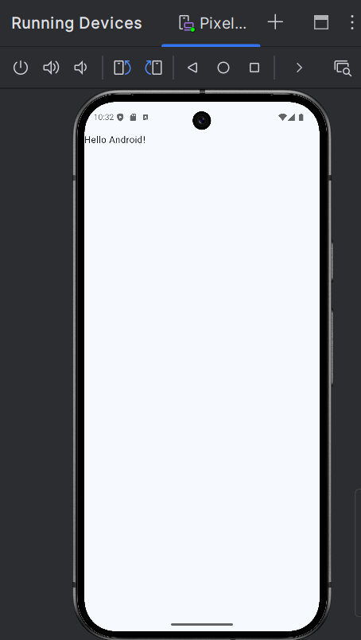

3. **Просмотр приложения:**

   - После установки приложение автоматически запустится на эмуляторе.
   - Вы можете взаимодействовать с ним так же, как на реальном устройстве.

---

## **Подключение физического устройства**

### **Подготовка устройства**

1. **Включение режима разработчика:**

   - Откройте **"Настройки"** на вашем устройстве.
   - Перейдите в **"О телефоне"** (или **"Сведения о телефоне"**).
   - Нажимайте на **"Номер сборки"** (Build Number) 7 раз подряд, пока не появится сообщение о том, что режим разработчика включён.

2. **Включение отладки по USB:**

   - Вернитесь в **"Настройки"** и перейдите в **"Для разработчиков"** или **"Параметры разработчика"**.
   - Активируйте опцию **"Отладка по USB"**.

3. **Подключение устройства к компьютеру:**
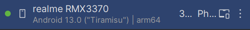
   - Используя USB-кабель, подключите устройство к компьютеру.
   - При появлении запроса на разрешение отладки по USB на устройстве нажмите **"Разрешить"**.

### **Настройка Android Studio**

1. **Проверка подключения устройства:**
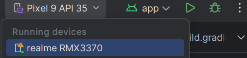
   - В Android Studio в панели устройств рядом с кнопкой **"Run"** должно отображаться подключенное устройство.
   - Если устройство не отображается:
     - Убедитесь, что USB-кабель исправен.
     - Попробуйте перезагрузить устройство и компьютер.
     - Для Windows: Установите необходимые драйверы для вашего устройства.

2. **Запуск приложения на устройстве:**

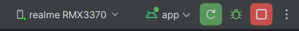
   - Выберите ваше устройство в списке.
   - Нажмите кнопку **"Run App"**.
   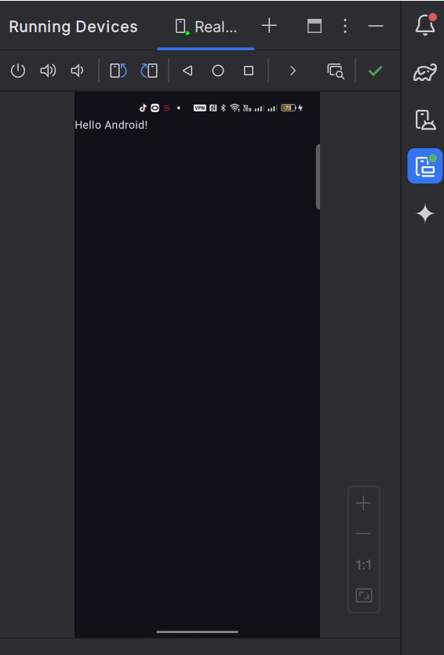
   - Приложение будет установлено и запущено на вашем физическом устройстве.

### **Отладка на устройстве**
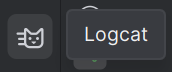
- **Logcat:**

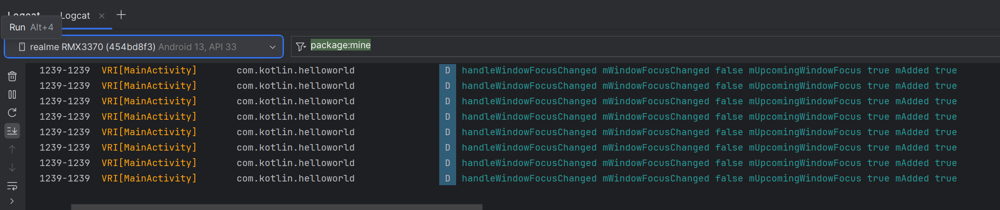

  - Используйте вкладку **"Logcat"** в Android Studio для просмотра логов приложения в режиме реального времени.

---


**Материалы по теме:**
- **Android Studio:**
  - [Официальная документация](https://developer.android.com/studio?hl=ru)
  
- **Как установить Android-студию:**
  - [Официальная документация](https://developer.android.com/studio/install?hl=ru)

- **Создание виртуальных устройств и управление ими:**
  - [Официальная документация](https://developer.android.com/studio/run/managing-avds)

- **Запуск приложений на аппаратном устройстве:**
  - [Подключение к устройству](https://developer.android.com/studio/run/device)
- **Отладка вашего приложения:**
  - [Включить отладку](https://developer.android.com/studio/debug?hl=ru)
- **Основы Android:**
   - [Основы Android](https://developer.android.com/get-started?hl=ru)
- **Создание приложения Hello World:**
   - [Основы Android](https://developer.android.com/codelabs/basic-android-kotlin-compose-first-app?continue=https%3A%2F%2Fdeveloper.android.com%2Fcourses%2Fpathways%2Fandroid-basics-compose-unit-1-pathway-2%23codelab-https%3A%2F%2Fdeveloper.android.com%2Fcodelabs%2Fbasic-android-kotlin-compose-first-app&%3Bhl=ru&hl=ru)
   
---

# 📚 Практический урок: Создаем  Android-приложение с 🎓 Jetpack Compose и 🎨Material Design    


Вы научитесь:

- Создавать новый проект в Android Studio.
- Использовать Jetpack Compose для создания пользовательского интерфейса.
- Применять компоненты Material Design для стилизации приложения.
- Изменять текст и стили текста.
- Работать с цветами и темами.

---

## 🎯 Цели урока

- **Создать приложение "Привет, мир!" с использованием Jetpack Compose.**
- **Изменить текст на свое имя и настроить стиль текста.**
- **Изменить цвет фона и применить тему Material Design.**
---

## 🛠 Шаг 1: Создание нового проекта в Android Studio

1. ** Android Studio:**

- Запустите Android Studio на вашем компьютере.
2. **Создайте новый проект:**
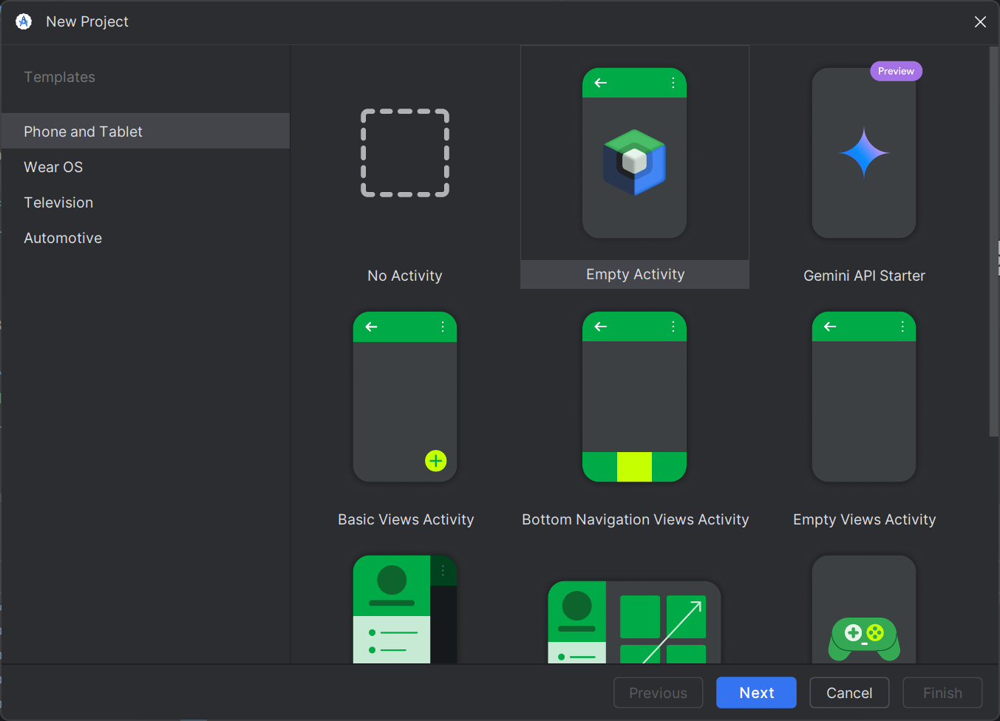
- В окне приветствия нажмите **"New Project"** (Новый проект).

3. **Выберите шаблон "Empty Activity":**

- В списке шаблонов выберите **"Empty Activity"**.
- Нажмите **"Next"**.

4. **Настройка проекта:**
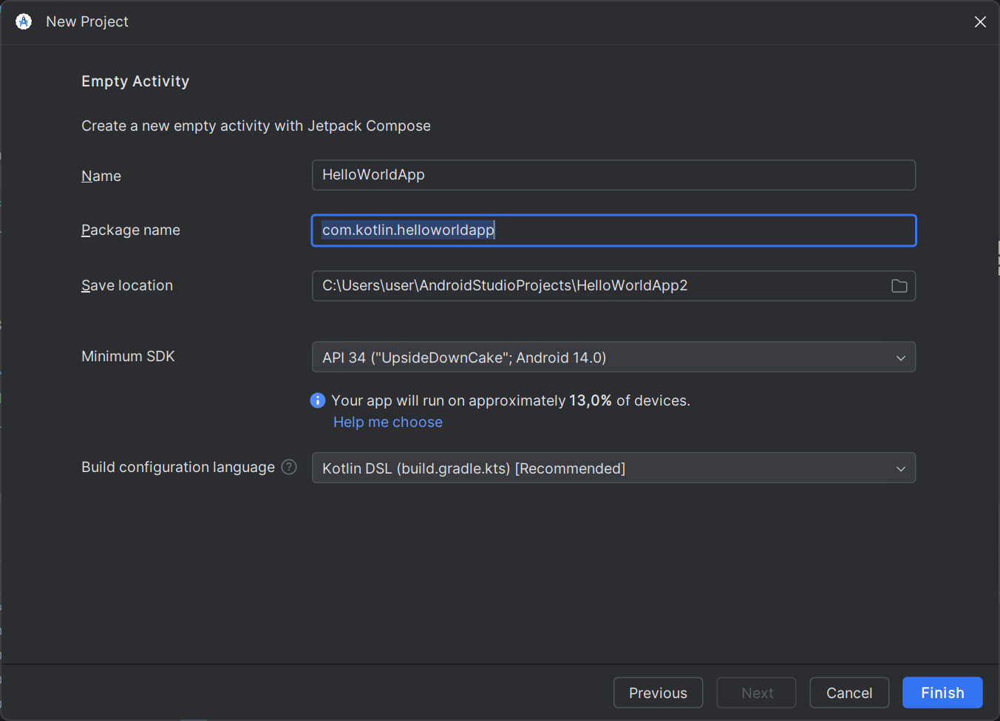

   - **Name (Имя):** Введите **"HelloWorldApp"**.
   - **Package name:** Оставьте как есть или измените по своему желанию **"com.example.helloworldapp"**.
   - **Save location:** Выберите папку для сохранения проекта.
   - Нажмите **"Finish"**.

---
## 📝 Рассмотрим код по умолчанию, как и говорилось ранее MainActivity.kt основной файл проект использует уже знакомый нам язык kotlin.

По умолчанию создается файл с уже готовой реализацией приложения выводящего на экран текст с фразой HelloWorld.

```kotlin
package com.kotlin.helloworld

import android.os.Bundle
import androidx.activity.ComponentActivity
import androidx.activity.compose.setContent
import androidx.activity.enableEdgeToEdge
import androidx.compose.foundation.layout.fillMaxSize
import androidx.compose.foundation.layout.padding
import androidx.compose.material3.Scaffold
import androidx.compose.material3.Text
import androidx.compose.runtime.Composable
import androidx.compose.ui.Modifier
import androidx.compose.ui.tooling.preview.Preview
import com.kotlin.helloworld.ui.theme.HelloWorldAppTheme

class MainActivity : ComponentActivity() {
    override fun onCreate(savedInstanceState: Bundle?) {
        super.onCreate(savedInstanceState)
        enableEdgeToEdge()
        setContent {
            HelloWorldAppTheme {
                Scaffold(modifier = Modifier.fillMaxSize()) { innerPadding ->
                    Greeting(
                        name = "Android",
                        modifier = Modifier.padding(innerPadding)
                    )
                }
            }
        }
    }
}

@Composable
fun Greeting(name: String, modifier: Modifier = Modifier) {
    Text(
        text = "Hello $name!",
        modifier = modifier
    )
}

@Preview(showBackground = true)
@Composable
fun GreetingPreview() {
    HelloWorldAppTheme {
        Greeting("Android")
    }
}
```
**Рассмотрим подробнее:**
```kotlin
class MainActivity : ComponentActivity() {
```
- **`MainActivity`** наследуется от `ComponentActivity`.

```kotlin
setContent {
            HelloWorldAppTheme {
                Scaffold(modifier = Modifier.fillMaxSize()) { innerPadding ->
                    Greeting(
                        name = "Android",
                        modifier = Modifier.padding(innerPadding)
                    )
                }
```
**Composable Function В Jetpack Compose Composable функции используются для программного определения всего пользовательского интерфейса вашего приложения. 

Таким образом, вам не нужно использовать какие-либо XML-файлы для компоновки приложения. Все, что вам нужно для создания составной функции, - это просто использовать аннотацию @Composable к названию функции. Основной синтаксис составной функции таков:**
```kotlin
@Composable
fun AnyUiComponent() {
    // Code for UI element
}
```

- **`setContent {}`** устанавливает содержимое для вывода на экран с помощью функций Compose.

```kotlin
HelloWorldAppTheme {
    
                }
```
Применяет тему Material Design по верх содержимого.

-**` Scaffold(modifier = Modifier.fillMaxSize()) {}**
компонент макета в Jetpack Compose, который устанавливает общую структуру страницы. 

**TopBar.** Здесь можно включить верхнюю панель навигации приложения. 

**BottomBar.** Раздел для размещения нижней панели навигации. 

**FloatingActionButton.**
Кнопка, которая часто используется для запуска основного действия. 

**Drawer.** Боковое меню, которое можно открывать и закрывать для показа дополнительных опций навигации. 

**Content.** Основное тело приложения, которое отображает основные элементы интерфейса. 

**Preview .** Android Studio предоставляет  возможность предварительного просмотра компонентов пользовательского интерфейса в самой Studio, причем динамически. 
```kotlin
@Composable
fun SimpleText(displayText: String) {
    Text(text = displayText)
}

@Preview
@Composable
fun SimpleTextPreview() {
    SimpleText("Preview text")
}
```
Итак, всякий раз, когда вы хотите протестировать какие-либо компоненты пользовательского интерфейса, вы можете просто предварительно просмотреть их в Android Studio, создав компонуемую функцию и используя аннотацию @Preview.

```kotlin
Greeting(
                        name = "Android",
                        modifier = Modifier.padding(innerPadding)
                    )
```
**`Greeting("Android")`** — вызывает compose-функцию `Greeting`.

```kotlin
@Composable
fun Greeting(name: String, modifier: Modifier = Modifier) {
    Text(
        text = "Hello $name!",
        modifier = modifier
    )
}
```
- **`Compose Функция Greeting`** отображает текст **"Hello Android!"**. (Hello с передаваемым именем $android) Чтобы отобразить текст, мы используем Text Composable и внутри него передаем строку, которую хотим отобразить. 

```kotlin
@Preview(showBackground = true)
@Composable
fun GreetingPreview() {
    HelloWorldAppTheme {
        Greeting("Android")
    }
}
```

- **`@Preview(showBackground = true)`** блок содержит продублированный вызов, для вывода превью до сборки приложения.

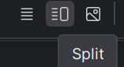

**Для вызова превью нажмите значок split или design**
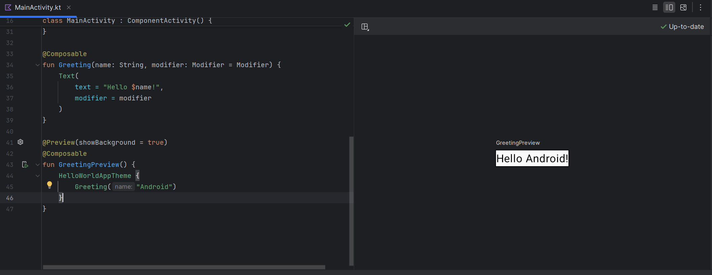
Превью отобразит пример работы выбранных элементов, но только тех которые продублированны в блок превью.

## ✏️ Практика: Измените текст на ваше имя

**Измените вызов функции `Greeting`:**
    ** Измените text = "Привет, меня зовут $name, я учусь в группе !",**
   На 
   Greeting("ФИО Группа Возраст")
   

   Вместо `" ФИО Группа Возраст"` введите свои данные.

   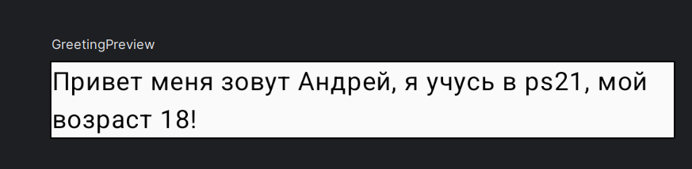
   Пример вывода.

   🎨 Далее дополним стилями Material Design

   **Для этого вверх нашего документа в импорт добавим компоненты Material Design:**

```kotlin
   import androidx.compose.material3.MaterialTheme
   import androidx.compose.material3.Typography
```

**Изменим функцию `Greeting`:**

``` kotlin
   @Composable
   fun Greeting(name: String, group:String, age:Int,  modifier: Modifier = Modifier) {
    Text(
        text = "Привет 👋 меня зовут $name, я учусь в $group, мой возраст $age!",
        modifier = modifier.padding(20.dp),
                style = MaterialTheme.typography.headlineMedium, color = White
    )
}
```
Теперь текст будет отображаться с использованием стиля `headlineMedium` из Material Design белым цветом. Аналогично можно применять другие свойства к тексту.

```kotlin
@Composable
fun SetTextStyling(displayText: String, style: TextStyle? = null, maxLines: Int? = null) {
    Text(
        text = displayText,
        modifier = Modifier.padding(16.dp),
        style = style ?: TextStyle.Default,
        overflow = TextOverflow.Ellipsis,
        maxLines = maxLines ?: Int.MAX_VALUE
    )
}
style = TextStyle(
    fontSize = 24.sp
    fontWeight = FontWeight.Bold
)
```

 
 **До**
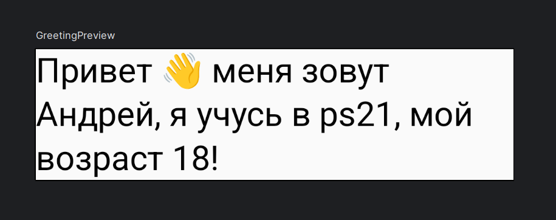
**После**

## ⬜🟨 Измененим цвета фона

**Импортируйте дополнительные компоненты:**
```kotlin
    import androidx.compose.foundation.background
    import androidx.compose.foundation.layout.Box
    import androidx.compose.foundation.layout.fillMaxSize
    import androidx.compose.ui.graphics.Color
```

**Изменим содержимое экрана через `setContent` в `MainActivity`:**
```kotlin
class MainActivity : ComponentActivity() {
    override fun onCreate(savedInstanceState: Bundle?) {
        super.onCreate(savedInstanceState)
        enableEdgeToEdge()
        setContent {
            HelloWorldAppTheme {
               FIO()
            }
        }
    }
}
```

**Внутри `setContent  HelloWorldAppTheme` оборачивает темой для изменения внешнего вида вызов функции в которую мы перенесем вывод данных `{
               FIO()
            }`**

**Для этого  с использованием Scaffold создадим новую функцию пример FIO, куда перенесем предыдущую реализацию.**
```kotlin
@Composable
fun FIO() {
    Scaffold(

    ) { innerPadding ->
        Box(
            modifier = Modifier
                .padding(innerPadding)
                 .background(Color(0xFF455A64)) // графитовый цвет
                .fillMaxSize()
        ) {
                Greeting(
                    // Собственная реализация вывода FIO
                    modifier = Modifier.padding(innerPadding)
                )
        }
    }
}

```
**Box** Box/Прямоугольник - это composable  макет, который используется для размещения дочерних элементов относительно его краев. 

Первоначально вместо прямоугольника использовался Stack. Но теперь Stack устарел и вместо него появился Box. 

Как следует из названия, дочерние элементы размещаются внутри родительского элемента. 

Дочерние элементы внутри прямоугольника рисуются в указанном порядке, и если дочерние элементы меньше родительского элемента, то они будут размещены внутри прямоугольника по умолчанию в соответствии с выравниванием.
```kotlin
@Composable
fun SimpleBoxComponent() {
    Box(modifier = Modifier.fillMaxSize().padding(16.dp)) {
        Image(imageResource(R.drawable.mindorks_cover))
        Text(
            modifier = Modifier.padding(start = 16.dp, top = 16.dp),
            text = "I am a text over Image",
            fontSize = 16.sp,
            color = Color.Red
        )
    }
}
```

 **Запустите приложение:**
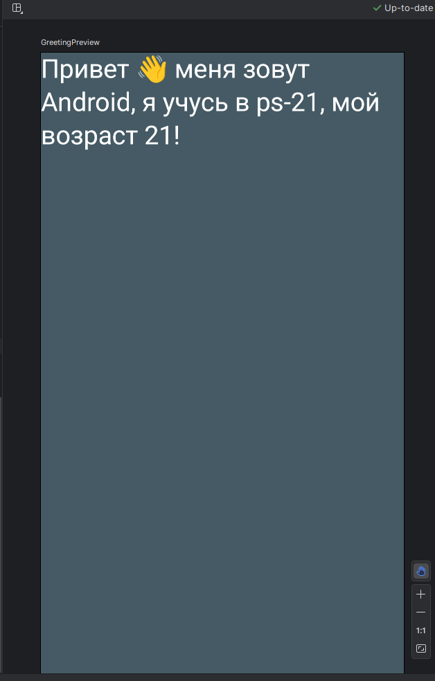
   - Фон приложения изменится на графитовый цвет.

## ✏️ Практика: Измените цвет фона и измените свойства текста  по своему желанию.
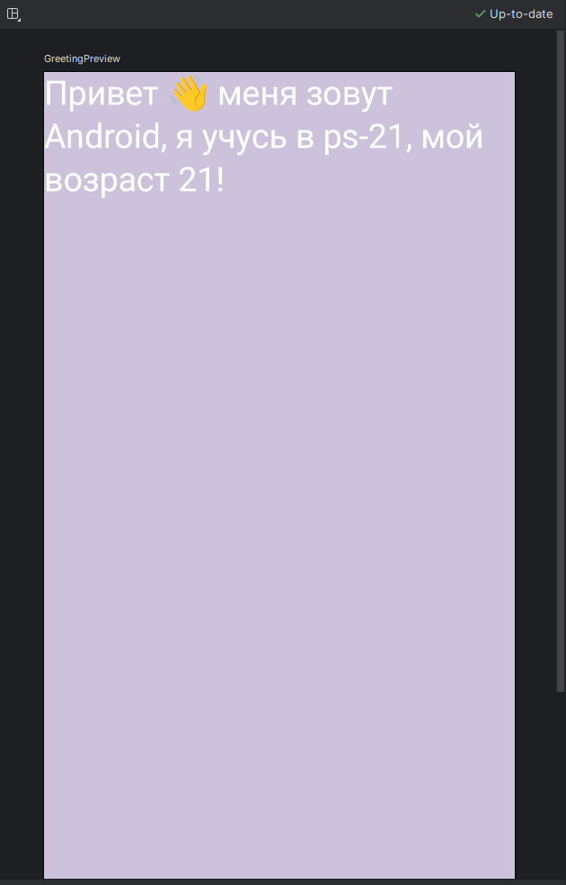
Пример реализации
## 🛣️ Добавление изображения

**Добавьте изображение в проект:**


- Скопируйте изображение (например, `test.png`) в папку `app/src/main/res/drawable`.

**Импортируйте необходимые компоненты:**

```kotlin   
   import androidx.compose.foundation.Image
   import androidx.compose.ui.res.painterResource
   import androidx.compose.ui.Alignment
   import androidx.compose.foundation.layout.Column
   import androidx.compose.foundation.layout.Spacer
   import androidx.compose.foundation.layout.height
   import androidx.compose.ui.unit.dp
```

**Измените содержимое функции `Greeting`:**
```kotlin
@Composable
fun Greeting(name: String, group:String, age:Int,  modifier: Modifier = Modifier) {
    Column(
        horizontalAlignment = Alignment.CenterHorizontally
    ) {
        Image(
            painter = painterResource(id = R.drawable.avatar),
            contentDescription = "Avatar",
            modifier = Modifier.height(300.dp)
        )
        Spacer(modifier = Modifier.height(16.dp))
        Text(
          //Реализация FIO
            modifier = modifier.padding(20.dp),
                style = MaterialTheme.typography.headlineMedium, color = White
        )
    }
}
```
**Column** Column/Столбец - это компонуемый элемент макета, который используется для размещения всех его дочерних элементов вертикально один за другим. Он похож на LinearLayout с вертикальной ориентацией. 

**Image** Чтобы отобразить изображение, мы можем использовать функцию composable Image.

```kotlin
@Composable
fun SimpleImageComponent() {
    // Image is a composable that is used to display some image.
    val image = imageResource(R.drawable.mindorks_cover)
    Column(
        modifier = Modifier.padding(16.dp)
    ) {
        Image(image)
    }
}
```

**Запустите приложение**


Результат


## ✏️ Практика: Создайте свой вариант

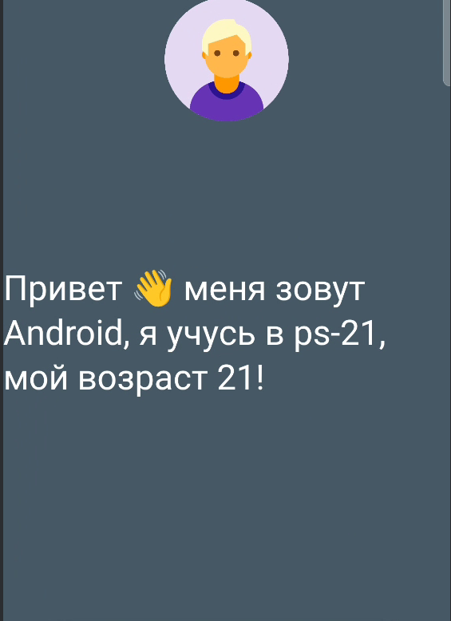

---
## 🛠 Далее добавление кнопки и обработка нажатий

**Импортируйте необходимые компоненты:**

```kotlin
 import androidx.compose.material3.Button
   import androidx.compose.material3.ButtonDefaults
   import androidx.compose.runtime.mutableStateOf
   import androidx.compose.runtime.remember
```
**Измените функцию `Greeting`:**

**Добавьте события на нажатие клавиши**
```kotlin
@Composable
fun Greeting(name: String, group:String, age:Int,  modifier: Modifier = Modifier) {
    var clickCount by remember { mutableStateOf(0) }
    Column(
        horizontalAlignment = Alignment.CenterHorizontally
    ) {
        Image(
            painter = painterResource(id = R.drawable.avatar),
            contentDescription = "Avatar",
            modifier = Modifier.height(300.dp)
        )
        Spacer(modifier = Modifier.height(16.dp))
        Text(
           //FIO
        )
        Spacer(modifier = Modifier.height(16.dp))
        Button(
            onClick = { clickCount++ },
            colors = ButtonDefaults.buttonColors(
                containerColor = MaterialTheme.colorScheme.primary
            )
        ) {
            Text(text = "Нажали $clickCount раз(а)")
        }
    }
}
```
**Button** Кнопки используются для выполнения некоторых действий, когда пользователь нажимает на них.Пример: 
```kotlin
@Composable
fun SimpleButtonComponent() {
    val context = ContextAmbient.current
    Button(
        onClick = {
            Toast.makeText(context, "Thanks for clicking!", Toast.LENGTH_LONG).show()
        },
        modifier = Modifier.padding(8.dp).fillMaxWidth()
    ) {
        Text("Click Me")
    }
}
```

**Запускаем приложение**

**Результат**

## 🔨 Далее примененим собственную тему

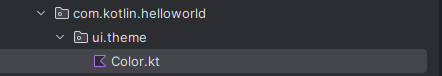

**Для этого откроем файл  `Color.kt`**
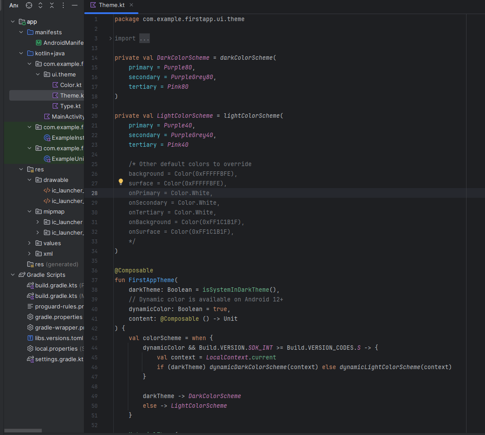

**Изменим файл добавив нашу кастомную тему**
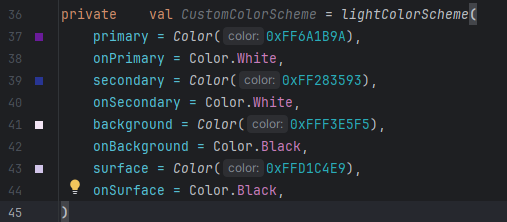
```kotlin
 val CustomColorScheme = lightColorScheme(
       primary = Color(0xFF6A1B9A),
       onPrimary = Color.White,
       secondary = Color(0xFF283593),
       onSecondary = Color.White,
       background = Color(0xFFF3E5F5),
       onBackground = Color.Black,
       surface = Color(0xFFD1C4E9),
       onSurface = Color.Black,
```
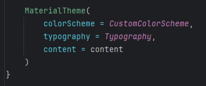

**Применим нашу тему изменив схему цветов на нашу custom**

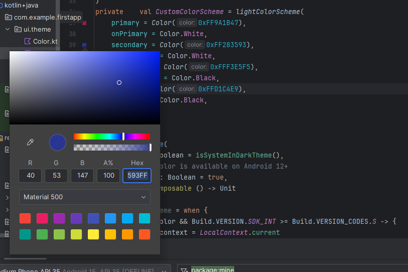
**Одно из приемуществ использования ide, как android studio для исменения цветов под себя достаточно менять их в ручную в место поиска кода необходимого цвета**


**Результат**


## 🌟 Добавление навигации

**Для добавление навигации доработаем функцию FIO**

```kotlin
@Composable
fun FIO() {
    Scaffold(

    ) { innerPadding ->
        Box(
            modifier = Modifier
                .padding(innerPadding)
                 .background(Color(0xFF455A64)) // графитовый цвет
                .fillMaxSize()
        ) {
                Greeting(
                    // Собственная реализация вывода FIO
                    modifier = Modifier.padding(innerPadding)
                )
        }
    }
}

```
**Выше до Box, добавим верхнее меню с иконкой "бургер" подобно header в вебе**
```kotlin
@Composable
fun FIO() {
    Scaffold(
        topBar = {
            TopAppBar(
                title = { Text("Мое первое приложение") },
                navigationIcon = {
                    IconButton(onClick = { /* Действие при нажатии */ }) {
                        Icon(Icons.Filled.Menu, contentDescription = "Меню")
                    }
                },
                colors = TopAppBarDefaults.topAppBarColors(
                    containerColor = MaterialTheme.colorScheme.primary
                )
            )
        }
    ) { innerPadding ->
        Box(
            modifier = Modifier
                .padding(innerPadding)
                .background(Color(0xFF455A64)) // графитовый цвет
                .fillMaxSize()
        ) {
                Greeting(
                    name = "Android",
                    group = "ps-21",
                    age = 21,
                    modifier = Modifier.padding(innerPadding)
                )
        }
    }
}

```


**Результат**

## 🌟 Помимо ручного редактирования и создания темы для Material Design 3 существует готовый генератор палитры с добавлением шрифтов и цветов по вашему выбору или на основе картинки. Для этого перейдите на сайт 

  - [material-theme-builder](https://material-foundation.github.io/material-theme-builder/)

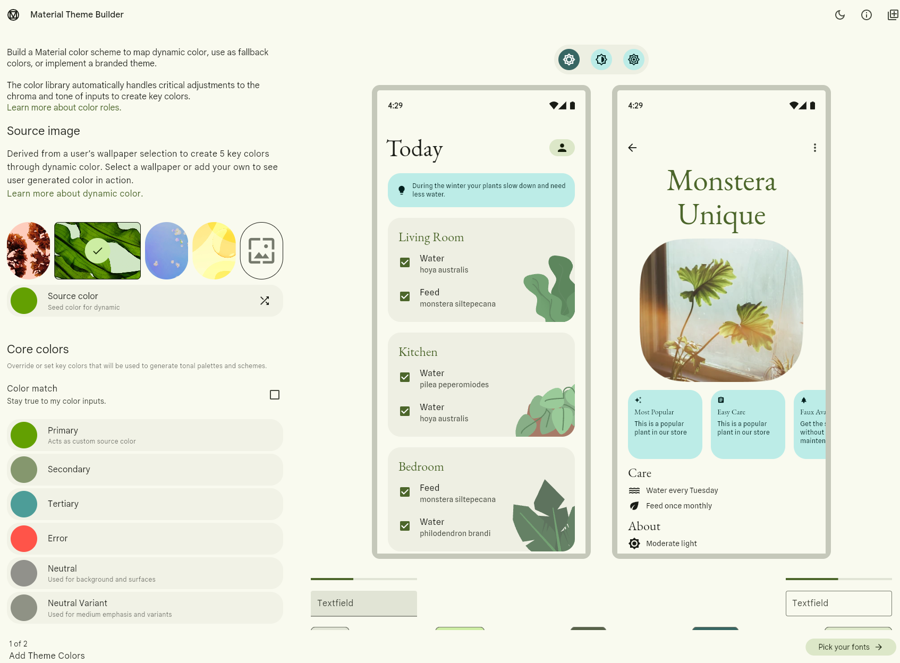 
**Сайт интуитивно понятен и не требует дополнительных навыков в программирование**

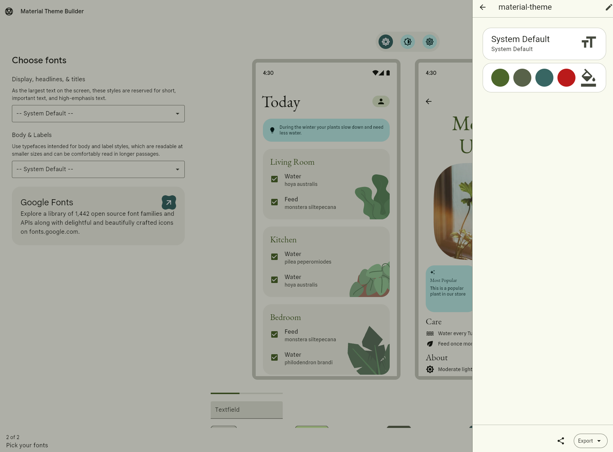
**Достаточно выбрать подходящие варианты и экспортировать тему**


**В нашем случае мы используем jetpack Compose**

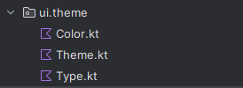

После добавляем в проект заменяя файлы нашей темы, согласно инструкции из архива с экспортом или меняя названия темы в полученных файлах на нашу тему.
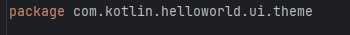

**🔥ВАЖНО: При активированном флаге   dynamicColor: Boolean = true приложение по умолчанию использует тему оформления телефона, для использования кастомной темы достаточно выбрать ее прописав или поставив флаг dynamicColor: Boolean = false**


**Пример подключенной сгенерированной темы**

## 🧧 Добавление иконки приложения

**Для добавление иконки не требуется дополнительной модификации или доработки кода, достаточно импортировать нужное изображение**


Правая кнопка по нашему проекту

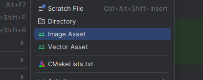

Выбираем New, Image asset

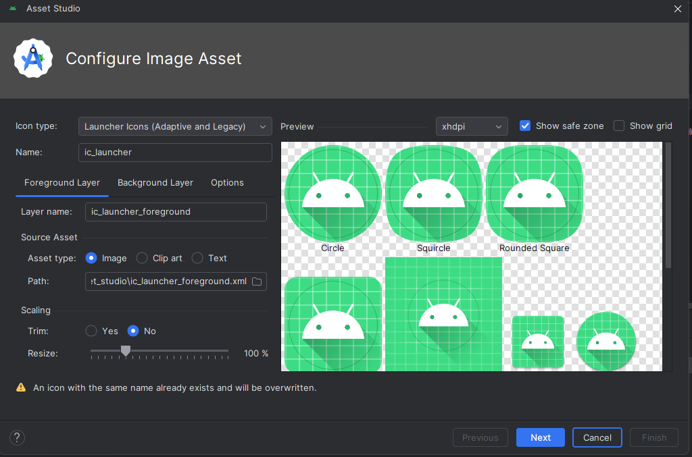

По умолчанию показывает во всех вариантах стандартный вариант

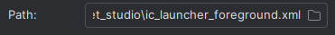

Импортируем через Path, выбираю путь до нужного изображения

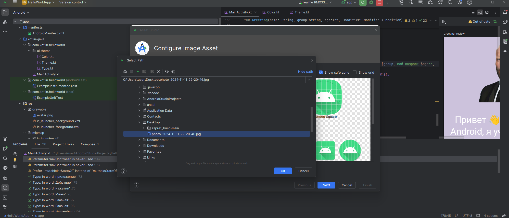

Далее можно в ручную подогнать под нужный размер и форму

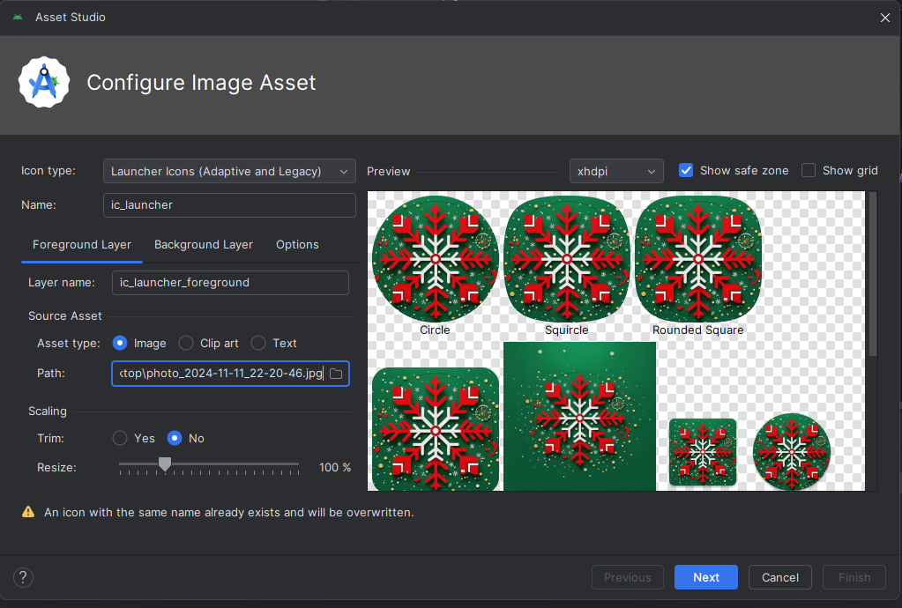

Подтверждаем замену предыдущих иконок

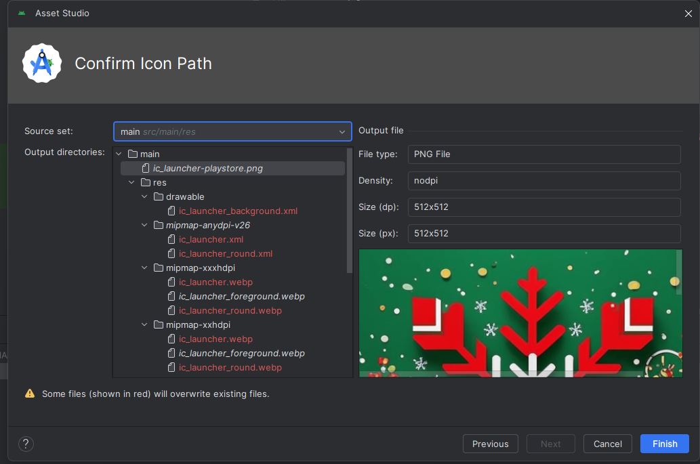

Запускаем

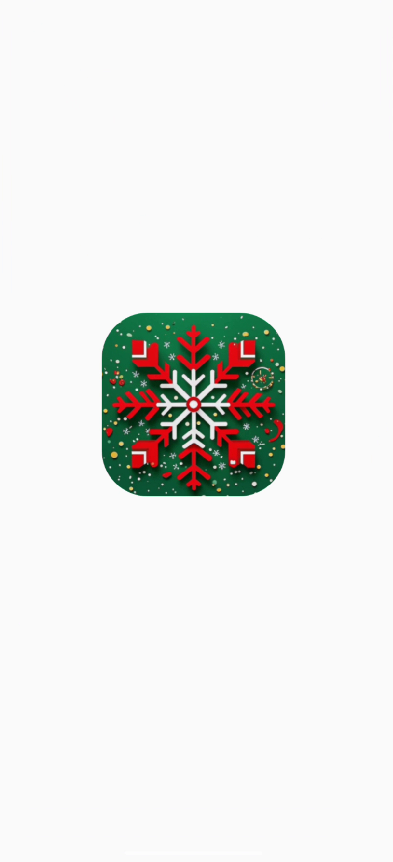

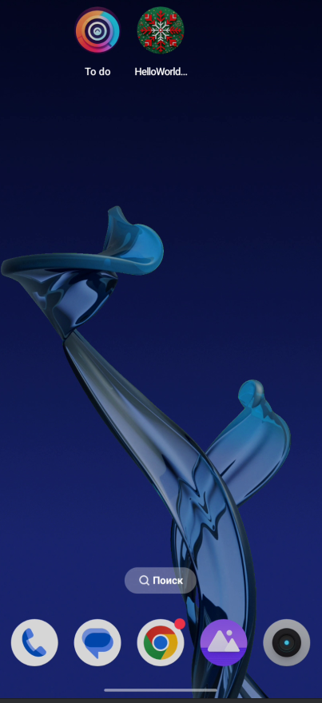

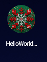

## 📖 Полезные ресурсы

- **📺Кодлаб по созданию первого приложения:**
  - [Основы Android](https://developer.android.com/get-started?hl=ru)
  - [Create your first Android app](https://developer.android.com/codelabs/basic-android-kotlin-compose-first-app)
  - [Создание приложения](https://developer.android.com/design?hl=ru)
  - [Руководство по архитектуре приложения](https://developer.android.com/topic/architecture?hl=ru)
  - [Примеры](https://developer.android.com/samples)
  - [Введение в анимацию](https://developer.android.com/develop/ui/views/animations/overview?hl=en)
  - [Разработка под Android в 2024 году](https://habr.com/ru/companies/otus/articles/800979/)

- **📑Документация Jetpack Compose:**
- [Jetpack Compose Overview](https://developer.android.com/jetpack/compose)
  - [tutorial](https://developer.android.com/develop/ui/compose/tutorial)
  - [docs](https://developer.android.com/develop/ui/compose/documentation)
  
- **🖌️Material Design:**
  - [Material Design 3 в Compose](https://developer.android.com/jetpack/compose/designsystems/material3)
   - [Material Design 3](https://m3.material.io/)
   - [Системы индивидуального дизайна в Compose](https://developer.android.com/develop/ui/compose/designsystems/custom?hl=ru)
   - [Дизайн для мобильных устройств](https://developer.android.com/design/ui/mobile?hl=ru)
   - [Compose Navigation](https://developer.android.com/develop/ui/compose/navigation?hl=ru)

## 📚 Дополнительные задания

- **Изучите другие компоненты Material Design 3:**
  - Добавьте **`TextField`** для ввода текста пользователем.
  - Используйте **`IconButton`** и добавьте иконки.
  
- **Анимации в Jetpack Compose:**
  - Ознакомьтесь с библиотекой **`androidx.compose.animation`**.
  - Добавьте простую анимацию к вашему приложению.
  
- **Изучите навигацию в Compose:**
  - Используйте библиотеку **`Navigation Compose`** для перемещения между экранами.